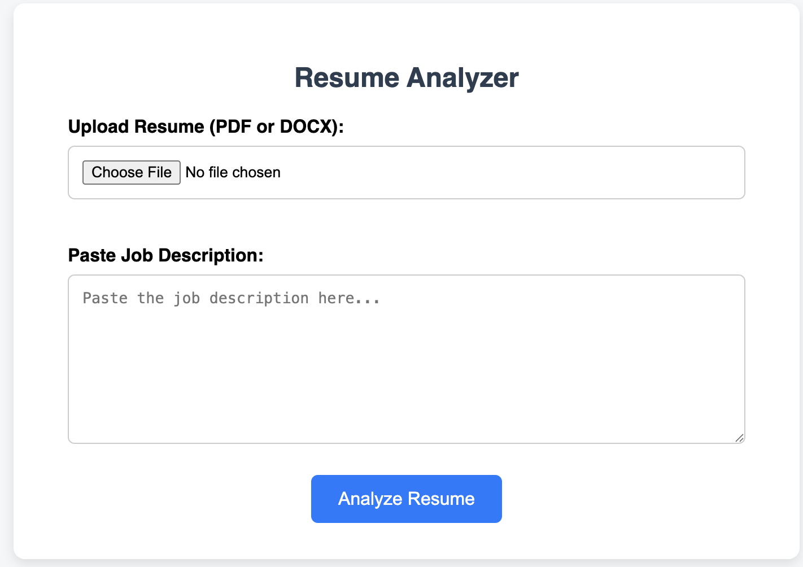

# 📄 Resume Analyzer with Job Description Matching

A web-based tool that helps job seekers tailor their resumes to specific job descriptions using keyword analysis, match scoring, and resume improvement suggestions — all through a clean and user-friendly interface.

---

## 🚀 Features

- ✅ Upload your **resume** (PDF or DOCX)
- ✅ Paste a **job description**
- ✅ View **keyword match percentage**
- ✅ See **matched vs. missing keywords**
- ✅ Get **suggested improvements**
- ✅ **User authentication** (signup/login/logout)
- ✅ Clean and responsive **UI with Flask templates**
- ✅ Built-in **session management** and security
- ✅ Ready for **deployment**

---

## 💡 Tech Stack

| Area          | Technology              |
|---------------|--------------------------|
| Backend       | Python, Flask            |
| Frontend      | HTML, CSS (Vanilla)      |
| NLP           | spaCy, collections.Counter |
| File Parsing  | pdfminer.six, python-docx |
| Auth          | Flask-Login, Werkzeug    |
| Data Storage  | JSON (for demo users)    |
| Visualization | *(Planned: Chart.js)*    |

---

## 🖼️ Screenshots



---

## 📦 Setup Instructions

### 1. Clone the repo

```bash
git clone https://github.com/YOUR_USERNAME/resume-analyzer.git
cd resume-analyzer
```

### 2. Create and activate a virtual environment
```bash
python3 -m venv venv
source venv/bin/activate       # On Windows: venv\Scripts\activate
```
### 3. Install dependencies
```bash
pip install -r requirements.txt
python3 -m spacy download en_core_web_sm
```

### 4. Run the App
```bash
python app.py
```


